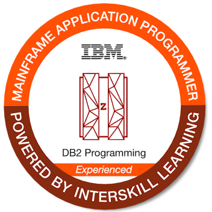

  <a href="https://github.com/leo10ui">
  
  

	
##
	  
### Hey There, I'm Leonardo a CS student interested in Cloud Computing, Networking, Data Science and Cybersecurity  
### Owner of 2a0e:b107:ba0::/44 RIPE-NCC IPv6 address space. Trying to get an ASN  
### My Emails:  
**Main Email:** <leonardo@leonardo.tec.br>  
**My Email at Fedora Project:** <leo10ui@fedoraproject.org>  
**My email at FATEC:** <leonardo.rodrigues22@fatec.sp.gov.br>  
**My email at UNIP:** <leonardo.rodrigues83@aluno.unip.br>
	
##
	

  
  
  
  

##

